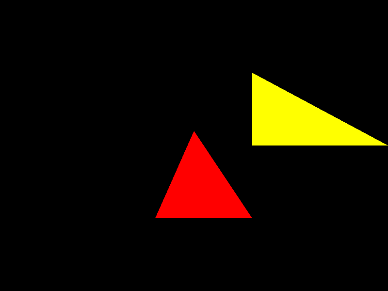
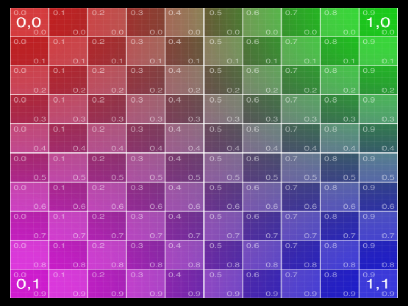

## tubugl core modules API

API documents: https://kenjispecial.github.io/tubugl-core/api/

## tubugl core modules GUIDE

### test core functionalities

## #00 -  test with program and arrayBuffer

[program.js][source-program] | [arrayBuffer][source-arrayBuffer] 

## #01 - test with program, arrayBuffer, and indexArrayBuffer

[program.js][source-program] | [arrayBuffer][source-arrayBuffer] 

## #02 - test with program, arrayBuffer, indexArrayBuffer, texture

[program.js][source-program] | [arrayBuffer][source-arrayBuffer] | [indexArrayBuffer][source-arrayBuffer] | [texture][source-texture]

[source-program]: https://github.com/kenjiSpecial/tubugl-core/blob/master/src/program.js
[source-program2]: https://github.com/kenjiSpecial/tubugl-core/blob/master/src/program2.js
[source-arrayBuffer]: https://github.com/kenjiSpecial/tubugl-core/blob/master/src/arrayBuffer.js
[source-draw]: https://github.com/kenjiSpecial/tubugl-core/blob/master/src/draw.js
[source-frameBuffer]: https://github.com/kenjiSpecial/tubugl-core/blob/master/src/frameBuffer.js
[source-indexArrayBuffer]: https://github.com/kenjiSpecial/tubugl-core/blob/master/src/indexArrayBuffer.js
[source-texture]: https://github.com/kenjiSpecial/tubugl-core/blob/master/src/texture.js
[source-tranformFeedback]: https://github.com/kenjiSpecial/tubugl-core/blob/master/src/tranformFeedback.js
[source-vao]: https://github.com/kenjiSpecial/tubugl-core/blob/master/src/vao.js
