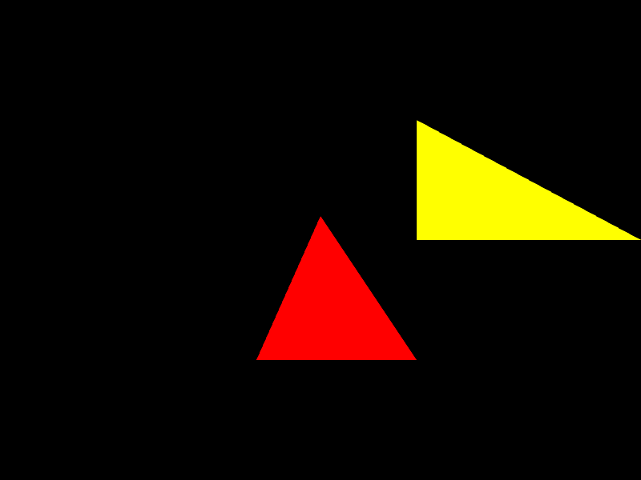
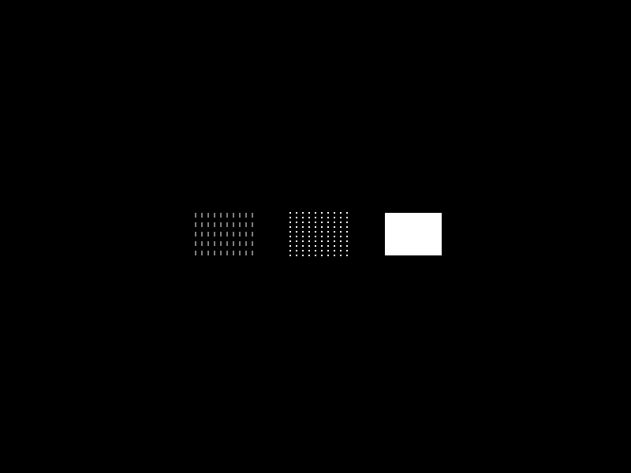
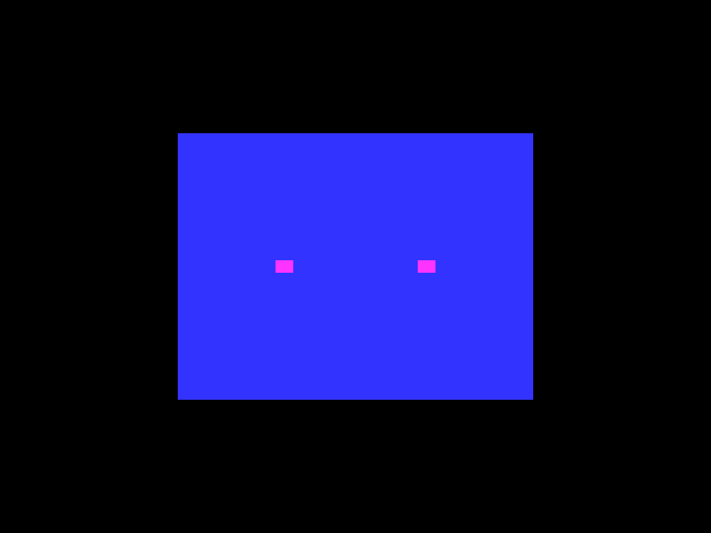
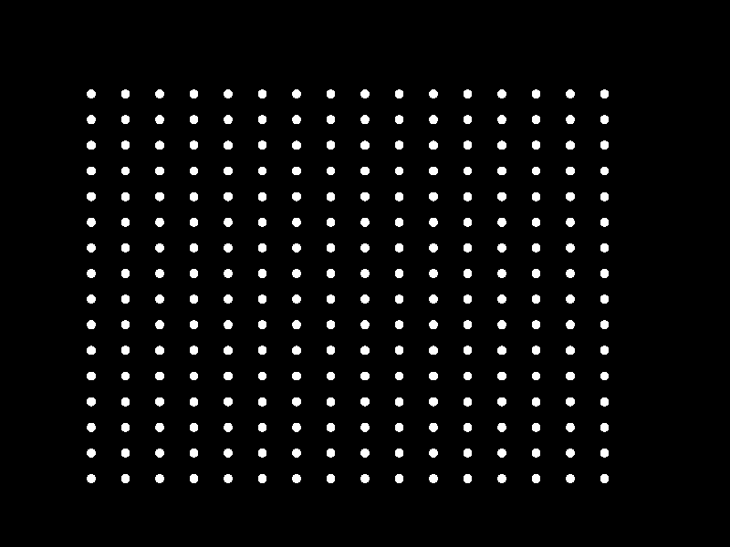

## tubugl core modules API

[API documents](https://kenjispecial.github.io/tubugl-core/api/)

## tubugl core modules Guide

- [Guide for Program](https://kenjispecial.github.io/tubugl-core/guide/program)
- [Guide for ArrayBuffer and IndexArrayBuffer](https://kenjispecial.github.io/tubugl-core/guide/buffer)

### test core functionalities

#### #00 -  test with program and arrayBuffer

{:height="50%" width="50%"}

[program.js][source-program] | [arrayBuffer][source-arrayBuffer] 

#### #01 - test with program, arrayBuffer, and indexArrayBuffer

{:height="50%" width="50%"}

[program.js][source-program] | [arrayBuffer][source-arrayBuffer] 

#### #02 - test with program, arrayBuffer, indexArrayBuffer, texture

{:height="50%" width="50%"}

[program.js][source-program] | [arrayBuffer][source-arrayBuffer] | [indexArrayBuffer][source-arrayBuffer] | [texture][source-texture]

#### #03 - test with draw function

{:height="50%" width="50%"}

 [program.js][source-program] | [arrayBuffer][source-arrayBuffer] | [indexArrayBuffer][source-arrayBuffer] | [draw.js][source-draw]

#### #04 - test with framebuffer

{:height="50%" width="50%"}

 [program.js][source-program] | [arrayBuffer][source-arrayBuffer] | [indexArrayBuffer][source-arrayBuffer] | [frameBuffer][source-frameBuffer]

#### #05 - test with vao

{:height="50%" width="50%"}

 [program.js][source-program] | [arrayBuffer][source-arrayBuffer] | [indexArrayBuffer][source-arrayBuffer] | [frameBuffer][source-frameBuffer] | [VAO][source-vao]

#### #06 - test with transformfeedback

{:height="50%" width="50%"}

 [program2.js][source-program2] | [arrayBuffer][source-arrayBuffer] [frameBuffer][source-frameBuffer] | [VAO][source-vao] | [transformFeedback][source-tranformFeedback]
 

#### #07 - test for gpgpu

{:height="50%" width="50%"}

 [program.js][source-program] | [arrayBuffer][source-arrayBuffer] | [indexArrayBuffer][source-arrayBuffer] | [frameBuffer][source-frameBuffer]

[source-program]: https://github.com/kenjiSpecial/tubugl-core/blob/master/src/program.js
[source-program2]: https://github.com/kenjiSpecial/tubugl-core/blob/master/src/program2.js
[source-arrayBuffer]: https://github.com/kenjiSpecial/tubugl-core/blob/master/src/arrayBuffer.js
[source-draw]: https://github.com/kenjiSpecial/tubugl-core/blob/master/src/draw.js
[source-frameBuffer]: https://github.com/kenjiSpecial/tubugl-core/blob/master/src/frameBuffer.js
[source-indexArrayBuffer]: https://github.com/kenjiSpecial/tubugl-core/blob/master/src/indexArrayBuffer.js
[source-texture]: https://github.com/kenjiSpecial/tubugl-core/blob/master/src/texture.js
[source-tranformFeedback]: https://github.com/kenjiSpecial/tubugl-core/blob/master/src/tranformFeedback.js
[source-vao]: https://github.com/kenjiSpecial/tubugl-core/blob/master/src/vao.js
